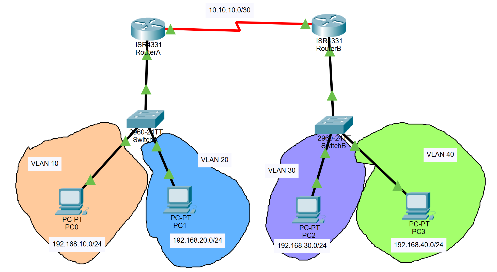

# SimpleNetwork

This is a network which use static routing and vlans to hierarchy the devices

## Requirements

You need the following programs:
* PacketTracer (>=7.3.1)

## Installation

First download the project or clone the repository. Next open "simplenetwork.pkt" file.

## Run

In order to test the network click whatever PC go to "Desktop" tab, select "Command Prompt" and type one of the next commands

```bash
ping 192.168.10.2
ping 192.168.20.2
ping 192.168.30.2
ping 192.168.40.2
```
## Views
Network


Ping from PC

